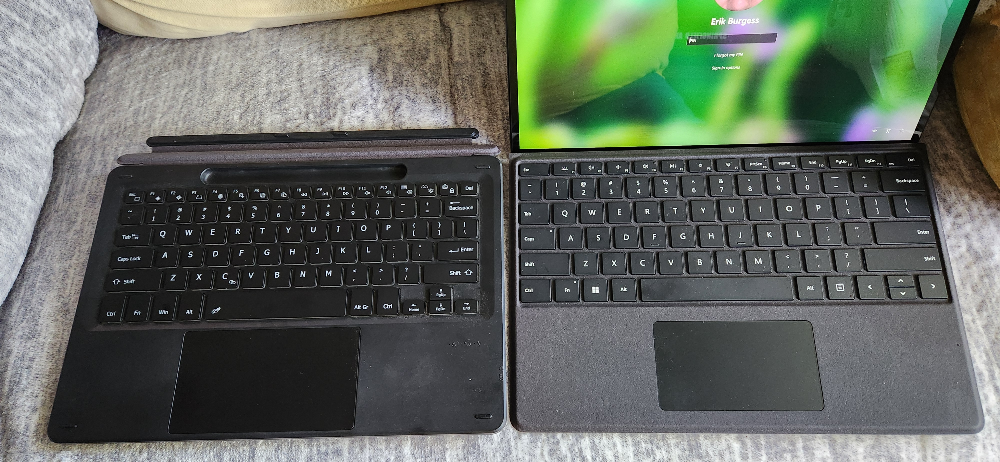
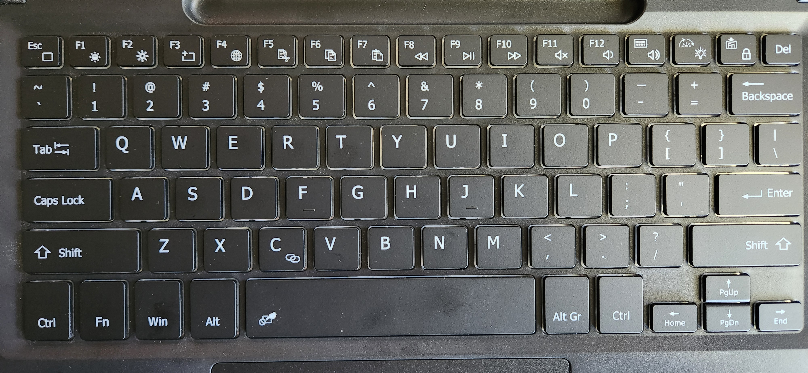

# A Keyboard Less Typed

I use a Microsoft Surface Pro 9 Tablet that doubles as a laptop for all of my college needs.  While I have a desktop at home, I prefer to have everything that I use on my person, so I can do all my schoolwork on campus.

In order for my tablet to function as a laptop, it must have a keyboard of some kind actively attached to it so Windows 11 knows when it needs to adjust itself into “Laptop” mode.  This can either be physically via proprietary ports, or it can be via Bluetooth.  My problem with the proprietary keyboard that is manufactured by Microsoft is that it has very light pressure keystrokes, allowing for easy typing mistakes, even when you barely touch the wrong key.

My goal was to find an alternative keyboard that requires more pressure to activate the keys in an effort to reduce my typing mistakes, while maintaining the default usability of being a cover for the tablet’s screen while not in use.  And so I purchased a third party keyboard cover that connects via Bluetooth, and comes equipped with taller, more “clicky” keystrokes.

After giving this new keyboard cover a few days of testing while completing some homework, I seemed to have found a solid replacement.  The unforeseen benefits include:
- longer tablet battery life because this new keyboard has an internal battery and connects via Bluetooth, so it doesn't even need to be physically touching the tablet to work as a keyboard and mouse (trackpad).
- Smaller buttons that require more pressure to actuate, reducing accidental keystrokes.
- Much more bright backlight that allows for much easier typing in reduced light environments.
- Quick keys that allow me to turn off the trackpad, so I can go ham on the keyboard without moving and/or clicking the mouse unintentionally.

However, there are a few cons with this keyboard that result in my returning to my old keyboard cover.  The first and largest problem with this new keyboard is that while it has a magnetic slot to hold and store my smart pen, and unlike my original keyboard, it does not charge the pen when stored in this slot.  This alone is almost a dealbreaker, as I use this pen for the majority of my note-taking in my classes.  The second and final nail in the coffin for this new keyboard is the fact that the entire top row of keys, including the Esc key, have alternate functions that seem to be the default every time I turn the keyboard on.  This means the Esc key is not the Esc key unless I turn off the “Fn lock” key every time I turn on the keyboard.

